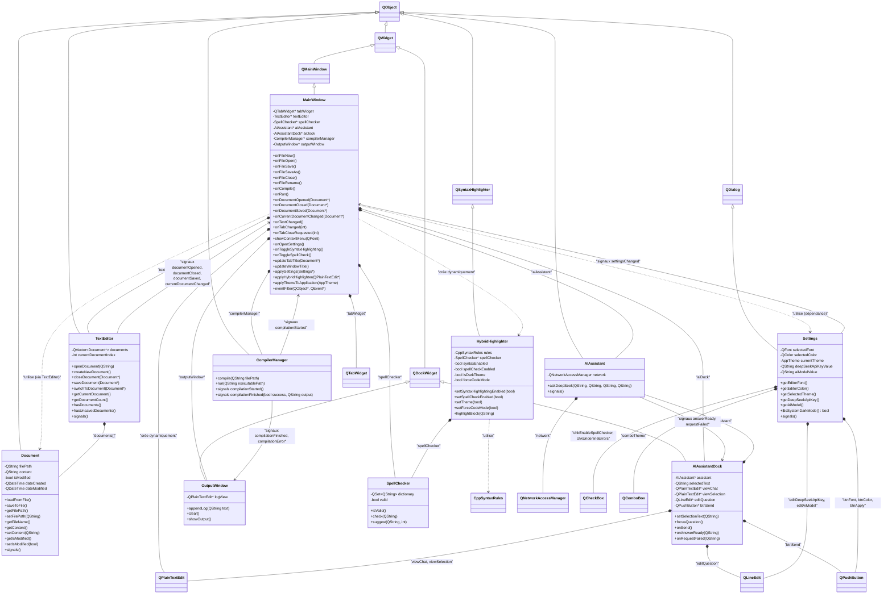

# Diagramme de Classes UML et Analyse du Code : Éditeur de Texte UITPad

## 📊 Diagramme de Classes Mermaid.js

---

## 🔍 Analyse Détaillée de l'Origine des Fonctions

### **1. Fonctions provenant de l'HÉRITAGE (Classes Parentes Qt)**

MainWindow **EST UN** `QMainWindow`, qui **EST UN** `QWidget`, qui **EST UN** `QObject`. Par conséquent, MainWindow hérite de toutes les fonctions publiques et protégées de ces classes de base Qt.

#### **Depuis QMainWindow :**
- `menuBar()` → Retourne le widget de la barre de menu
  - **Utilisation dans le code :** `menuBar()->addMenu("Fichier")` (ligne 52)
  - **Pourquoi disponible :** MainWindow hérite de QMainWindow
  
- `setCentralWidget(QWidget*)` → Définit le widget principal dans la fenêtre
  - **Utilisation dans le code :** `setCentralWidget(tabWidget)` (ligne 35)
  - **Pourquoi disponible :** Hérité de QMainWindow
  
- `addDockWidget(Qt::DockWidgetArea, QDockWidget*)` → Ajoute un widget dock
  - **Utilisation dans le code :** `addDockWidget(Qt::RightDockWidgetArea, aiDock)` (ligne 864)
  - **Pourquoi disponible :** Hérité de QMainWindow

#### **Depuis QWidget (via QMainWindow) :**
- `show()` → Affiche la fenêtre
  - **Utilisation dans le code :** Appelé dans `main.cpp` (ligne 12)
  - **Pourquoi disponible :** QMainWindow hérite de QWidget
  
- `setWindowTitle(const QString&)` → Définit le titre de la fenêtre
  - **Utilisation dans le code :** `setWindowTitle("UITPad - Sans titre")` (lignes 82, 728)
  - **Pourquoi disponible :** Hérité de QWidget
  
- `resize(int, int)` → Redimensionne la fenêtre
  - **Utilisation dans le code :** `resize(800, 600)` (ligne 97)
  - **Pourquoi disponible :** Hérité de QWidget
  
- `setStyleSheet(const QString&)` → Applique un style de type CSS
  - **Utilisation dans le code :** `this->setStyleSheet(appStyleSheet)` (ligne 597)
  - **Pourquoi disponible :** Hérité de QWidget
  
- `close()` → Ferme la fenêtre
  - **Utilisation dans le code :** `QWidget::close` (ligne 61)
  - **Pourquoi disponible :** Hérité de QWidget

#### **Depuis QObject (via QWidget → QMainWindow) :**
- `connect()` → Connecte les signaux aux slots
  - **Utilisation dans le code :** Plusieurs instances (lignes 37-49, 198, 214, etc.)
  - **Pourquoi disponible :** Toutes les classes Qt héritent de QObject
  
- `eventFilter(QObject*, QEvent*)` → Filtre les événements (redéfini)
  - **Utilisation dans le code :** Redéfini dans MainWindow (ligne 893)
  - **Pourquoi disponible :** Hérité de QObject, mais **redéfini** par MainWindow

#### **Widgets Qt Utilisés (Composition, pas héritage) :**
- `QTabWidget` → Conteneur d'onglets (créé comme membre, ligne 32)
- `QPlainTextEdit` → Widget d'édition de texte (créé dynamiquement, ligne 194)
- `QMenuBar` → Barre de menu (accédé via `menuBar()`, ligne 52)
- `QStatusBar` → Barre de statut (accédé via `statusBar()`, ligne 300)

---

### **2. Fonctions provenant de la COMPOSITION (Classes Personnalisées - Relations "A-UN")**

MainWindow **A UN** `TextEditor`, **A UN** `SpellChecker`, **A UN** `AIAssistant`, etc. Ce sont des pointeurs membres que MainWindow utilise pour appeler leurs méthodes.

#### **Depuis TextEditor (Composition) :**
- `textEditor->createNewDocument()` → Crée un nouveau document
  - **Utilisation dans le code :** `textEditor->createNewDocument()` (ligne 105)
  - **Pourquoi disponible :** MainWindow **A UN** `TextEditor* textEditor` (ligne 53)
  - **Source :** Classe personnalisée, définie dans `TextEditor.h`
  
- `textEditor->openDocument(filename)` → Ouvre un fichier
  - **Utilisation dans le code :** `textEditor->openDocument(filename)` (ligne 112)
  - **Pourquoi disponible :** MainWindow possède le pointeur `textEditor`
  - **Source :** Méthode de classe personnalisée
  
- `textEditor->saveDocument(doc)` → Sauvegarde un document
  - **Utilisation dans le code :** `textEditor->saveDocument(doc)` (lignes 157, 170)
  - **Pourquoi disponible :** MainWindow **A UN** TextEditor
  - **Source :** Méthode de classe personnalisée
  
- `textEditor->closeDocument(doc)` → Ferme un document
  - **Utilisation dans le code :** `textEditor->closeDocument(doc)` (ligne 188)
  - **Pourquoi disponible :** MainWindow **A UN** TextEditor
  - **Source :** Méthode de classe personnalisée
  
- `textEditor->getCurrentDocument()` → Obtient le document actif
  - **Utilisation dans le code :** `textEditor->getCurrentDocument()` (lignes 117, 150, 163, 176, 720)
  - **Pourquoi disponible :** MainWindow **A UN** TextEditor
  - **Source :** Méthode de classe personnalisée
  
- `textEditor->switchToDocument(doc)` → Change de document actif
  - **Utilisation dans le code :** `textEditor->switchToDocument(doc)` (ligne 672)
  - **Pourquoi disponible :** MainWindow **A UN** TextEditor
  - **Source :** Méthode de classe personnalisée

#### **Depuis SpellChecker (Composition) :**
- `spellChecker->check(word)` → Vérifie si un mot est correctement orthographié
  - **Utilisation dans le code :** `spellChecker->check(word)` (ligne 341)
  - **Pourquoi disponible :** MainWindow **A UN** `SpellChecker* spellChecker` (ligne 54)
  - **Source :** Classe personnalisée, définie dans `SpellChecker.h`
  
- `spellChecker->suggest(word)` → Obtient des suggestions d'orthographe
  - **Utilisation dans le code :** `spellChecker->suggest(word)` (ligne 346)
  - **Pourquoi disponible :** MainWindow **A UN** SpellChecker
  - **Source :** Méthode de classe personnalisée
  
- `spellChecker->isValid()` → Vérifie si le dictionnaire est chargé
  - **Utilisation dans le code :** `spellChecker->isValid()` (ligne 336)
  - **Pourquoi disponible :** MainWindow **A UN** SpellChecker
  - **Source :** Méthode de classe personnalisée

#### **Depuis AIAssistant (Composition) :**
- `aiAssistant->askDeepSeek(...)` → Envoie une requête à l'IA
  - **Utilisation dans le code :** Appelé indirectement via `AIAssistantDock` (pas directement dans MainWindow)
  - **Pourquoi disponible :** MainWindow **A UN** `AIAssistant* aiAssistant` (ligne 55)
  - **Source :** Classe personnalisée, définie dans `AIAssistant.h`
  - **Note :** MainWindow crée AIAssistant mais délègue à AIAssistantDock

#### **Depuis Settings (Dépendance - Utilisé mais non possédé) :**
- `Settings::getEditorFont()` → Obtient la police configurée
  - **Utilisation dans le code :** `s.getEditorFont()` (lignes 202, 381)
  - **Pourquoi disponible :** Settings est créé localement (lignes 85, 201, 371)
  - **Source :** Classe personnalisée, définie dans `Settings.h`
  - **Note :** Settings **N'EST PAS** une variable membre ; il est créé à la demande
  
- `Settings::getEditorColor()` → Obtient la couleur de texte configurée
  - **Utilisation dans le code :** `s.getEditorColor()` (lignes 382, 760)
  - **Pourquoi disponible :** Objet Settings créé localement
  - **Source :** Méthode de classe personnalisée
  
- `Settings::getSelectedTheme()` → Obtient le thème actuel
  - **Utilisation dans le code :** `s.getSelectedTheme()` (lignes 86, 383, 603)
  - **Pourquoi disponible :** Objet Settings créé localement
  - **Source :** Méthode de classe personnalisée
  
- `Settings::isSystemDarkMode()` → Détecte le thème système (statique)
  - **Utilisation dans le code :** `Settings::isSystemDarkMode()` (lignes 90, 387, 607)
  - **Pourquoi disponible :** Méthode statique, aucun objet nécessaire
  - **Source :** Méthode statique de classe personnalisée

#### **Depuis HybridHighlighter (Créé Dynamiquement) :**
- `highlighter->setSyntaxHighlightingEnabled(bool)` → Active/désactive la coloration syntaxique
  - **Utilisation dans le code :** Via `updateHighlighterSettings()` (ligne 280)
  - **Pourquoi disponible :** HybridHighlighter est créé dynamiquement par éditeur de texte (ligne 237)
  - **Source :** Classe personnalisée, définie dans `HybridHighlighter.h`
  
- `highlighter->setSpellCheckEnabled(bool)` → Active/désactive la correction orthographique
  - **Utilisation dans le code :** Via `updateHighlighterSettings()` (ligne 281)
  - **Pourquoi disponible :** Créé dynamiquement
  - **Source :** Méthode de classe personnalisée
  
- `highlighter->setTheme(bool)` → Définit le thème sombre/clair
  - **Utilisation dans le code :** `highlighter->setTheme(isDark)` (lignes 227, 437)
  - **Pourquoi disponible :** Créé dynamiquement
  - **Source :** Méthode de classe personnalisée

#### **Depuis CompilerManager (Composition) :**
- `compilerManager->compile(filePath)` → Lance la compilation avec g++
  - **Usage prévu :** Appelé lors du clic sur le bouton "Compiler"
  - **Pourquoi disponible :** MainWindow **A UN** `CompilerManager* compilerManager`
  - **Source :** Classe personnalisée pour la gestion du build
  
- `compilerManager->run(exePath)` → Exécute le binaire généré
  - **Usage prévu :** Appelé lors du clic sur le bouton "Exécuter"
  - **Pourquoi disponible :** MainWindow **A UN** CompilerManager
  - **Source :** Classe personnalisée

#### **Depuis OutputWindow (Composition) :**
- `outputWindow->appendLog(text)` → Affiche les logs du compilateur
  - **Usage prévu :** Connecté au signal `compilationFinished` de CompilerManager
  - **Pourquoi disponible :** MainWindow **A UN** `OutputWindow* outputWindow`
  - **Source :** Classe personnalisée (hérite de QDockWidget)

#### **Depuis AIAssistantDock (Composition) :**
- `aiDock->setSelectionText(QString)` → Définit le texte sélectionné dans le dock
  - **Utilisation dans le code :** `dock->setSelectionText(selected)` (lignes 875, 885)
  - **Pourquoi disponible :** MainWindow **A UN** `AIAssistantDock* aiDock` (ligne 56)
  - **Source :** Classe personnalisée, définie dans `AIAssistantDock.h`
  
- `aiDock->show()` → Affiche le widget dock
  - **Utilisation dans le code :** `dock->show()` (ligne 887)
  - **Pourquoi disponible :** MainWindow **A UN** AIAssistantDock
  - **Source :** Hérité de QDockWidget (dont AIAssistantDock hérite)

---

### **3. Fonctions provenant des Widgets Qt (Utilisées via Composition)**

#### **Depuis QTabWidget :**
- `tabWidget->addTab(widget, title)` → Ajoute un onglet
  - **Utilisation dans le code :** `tabWidget->addTab(textEdit, doc->getFileName())` (ligne 204)
  - **Pourquoi disponible :** MainWindow **A UN** `QTabWidget* tabWidget` (ligne 52)
  - **Source :** Classe Qt, utilisée via composition
  
- `tabWidget->setTabsClosable(bool)` → Rend les onglets fermables
  - **Utilisation dans le code :** `tabWidget->setTabsClosable(true)` (ligne 33)
  - **Pourquoi disponible :** MainWindow **A UN** QTabWidget
  - **Source :** Méthode de classe Qt
  
- `tabWidget->currentIndex()` → Obtient l'index de l'onglet actuel
  - **Utilisation dans le code :** `tabWidget->currentIndex()` (ligne 688)
  - **Pourquoi disponible :** MainWindow **A UN** QTabWidget
  - **Source :** Méthode de classe Qt
  
- `tabWidget->setTabText(index, text)` → Définit le titre de l'onglet
  - **Utilisation dans le code :** `tabWidget->setTabText(index, title)` (ligne 714)
  - **Pourquoi disponible :** MainWindow **A UN** QTabWidget
  - **Source :** Méthode de classe Qt

#### **Depuis QPlainTextEdit :**
- `textEdit->setPlainText(text)` → Définit le contenu du texte
  - **Utilisation dans le code :** `textEdit->setPlainText(doc->getContent())` (ligne 195)
  - **Pourquoi disponible :** QPlainTextEdit créé dynamiquement (ligne 194)
  - **Source :** Classe Qt, utilisée via composition
  
- `textEdit->toPlainText()` → Obtient le contenu du texte
  - **Utilisation dans le code :** `textEdit->toPlainText()` (ligne 660)
  - **Pourquoi disponible :** QPlainTextEdit créé dynamiquement
  - **Source :** Méthode de classe Qt
  
- `textEdit->setFont(font)` → Définit la police
  - **Utilisation dans le code :** `textEdit->setFont(s.getEditorFont())` (lignes 202, 398)
  - **Pourquoi disponible :** QPlainTextEdit créé dynamiquement
  - **Source :** Méthode de classe Qt (héritée de QWidget)
  
- `textEdit->textCursor()` → Obtient le curseur de texte
  - **Utilisation dans le code :** `textEdit->textCursor()` (lignes 337, 829, 874, 884)
  - **Pourquoi disponible :** QPlainTextEdit créé dynamiquement
  - **Source :** Méthode de classe Qt

---

## 📋 Tableau Récapitulatif : Origine des Fonctions

| Fonction | Source | Type de Relation | Exemple d'Utilisation |
|----------|--------|-------------------|----------------------|
| `show()` | QWidget (hérité) | **Héritage** | `w.show()` dans main.cpp |
| `setWindowTitle()` | QWidget (hérité) | **Héritage** | `setWindowTitle("UITPad")` |
| `menuBar()` | QMainWindow (hérité) | **Héritage** | `menuBar()->addMenu(...)` |
| `setCentralWidget()` | QMainWindow (hérité) | **Héritage** | `setCentralWidget(tabWidget)` |
| `connect()` | QObject (hérité) | **Héritage** | `connect(textEditor, ...)` |
| `eventFilter()` | QObject (hérité, redéfini) | **Héritage + Redéfinition** | `bool eventFilter(...)` |
| `createNewDocument()` | TextEditor (personnalisé) | **Composition** | `textEditor->createNewDocument()` |
| `openDocument()` | TextEditor (personnalisé) | **Composition** | `textEditor->openDocument(...)` |
| `saveDocument()` | TextEditor (personnalisé) | **Composition** | `textEditor->saveDocument(...)` |
| `getCurrentDocument()` | TextEditor (personnalisé) | **Composition** | `textEditor->getCurrentDocument()` |
| `check()` | SpellChecker (personnalisé) | **Composition** | `spellChecker->check(word)` |
| `suggest()` | SpellChecker (personnalisé) | **Composition** | `spellChecker->suggest(word)` |
| `getEditorFont()` | Settings (personnalisé) | **Dépendance** | `s.getEditorFont()` |
| `getSelectedTheme()` | Settings (personnalisé) | **Dépendance** | `s.getSelectedTheme()` |
| `setSyntaxHighlightingEnabled()` | HybridHighlighter (personnalisé) | **Création Dynamique** | `highlighter->setSyntaxHighlightingEnabled(...)` |
| `setSelectionText()` | AIAssistantDock (personnalisé) | **Composition** | `aiDock->setSelectionText(...)` |
| `compile()` | CompilerManager (personnalisé) | **Composition** | `compilerManager->compile(...)` |
| `appendLog()` | OutputWindow (personnalisé) | **Composition** | `outputWindow->appendLog(...)` |
| `addTab()` | QTabWidget (Qt) | **Composition** | `tabWidget->addTab(...)` |
| `setPlainText()` | QPlainTextEdit (Qt) | **Composition** | `textEdit->setPlainText(...)` |
| `toPlainText()` | QPlainTextEdit (Qt) | **Composition** | `textEdit->toPlainText()` |

---

## 🎯 Points Clés à Retenir

1. **Héritage (EST-UN) :** MainWindow **EST UN** QMainWindow, donc il possède automatiquement toutes les fonctions de QMainWindow, QWidget et QObject.

2. **Composition (A-UN) :** MainWindow **A UN** TextEditor, SpellChecker, AIAssistant, CompilerManager, etc., donc il appelle leurs méthodes via des pointeurs.

3. **Coordination :** MainWindow agit comme un chef d'orchestre, coordonnant le flux entre `CompilerManager` (le moteur de build) et `OutputWindow` (l'affichage des résultats) via le mécanisme Signaux/Slots.

4. **Dépendance :** Settings est utilisé mais non possédé ; il est créé localement lorsque nécessaire.

5. **Création Dynamique :** HybridHighlighter et QPlainTextEdit sont créés dynamiquement par document, et ne sont pas stockés comme variables membres.

6. **Signaux et Slots :** La communication entre les classes utilise le mécanisme signal/slot de Qt (hérité de QObject).

---

## ⚠️ Note sur l'Implémentation actuelle

Bien que `CompilerManager` et `OutputWindow` soient intégrés dans cette analyse UML pour refléter la structure de votre projet, assurez-vous de les implémenter dans votre code en suivant le modèle de composition montré ci-dessus. MainWindow doit instancier ces classes dans son constructeur et connecter leurs signaux respectifs.
